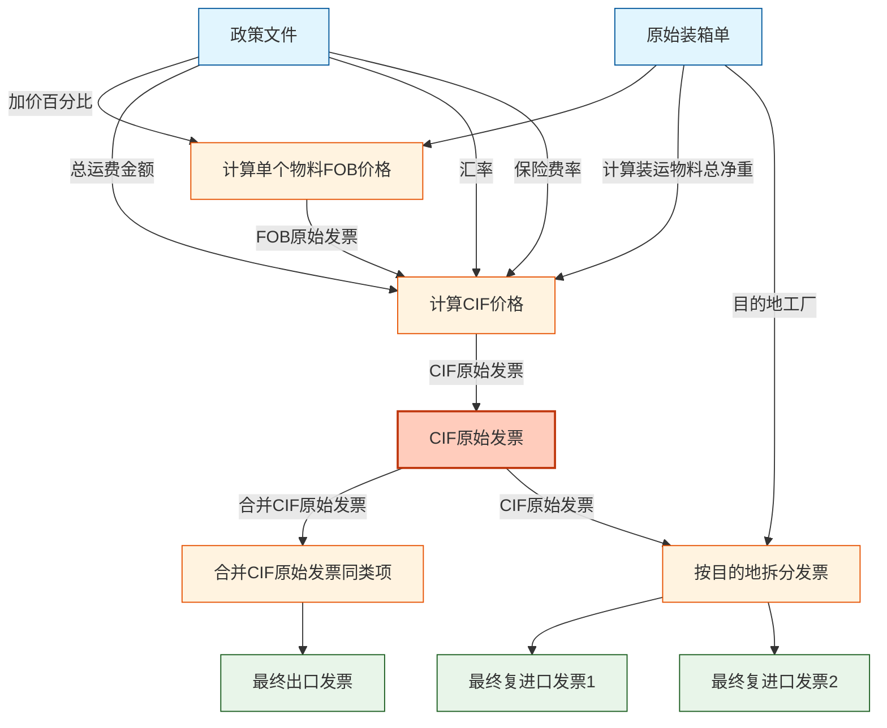
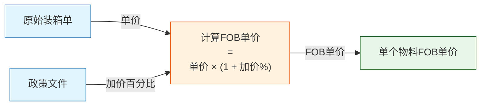
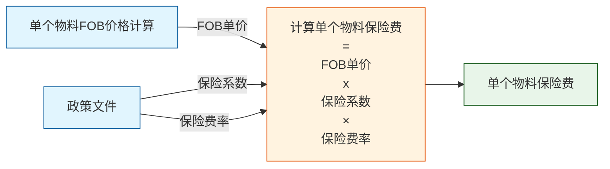
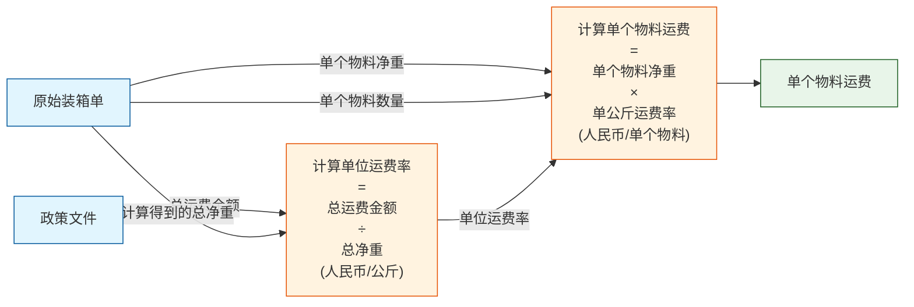
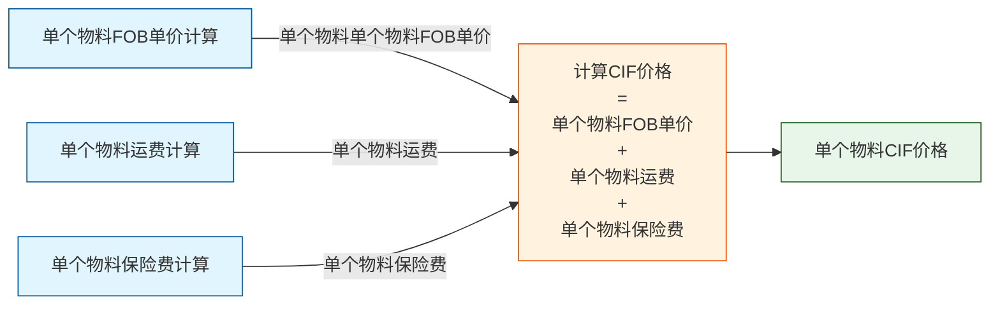
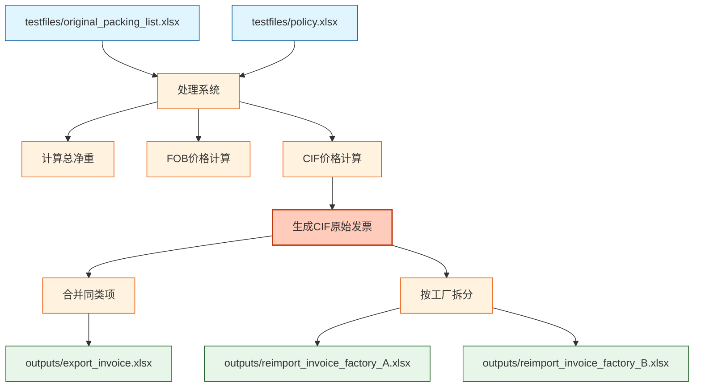

# 装运清单处理工作流程

本文档概述了处理装运清单并生成出口和复进口收据的完整工作流程。

## 流程图

### CIIBER原始装箱单到出口/在进口发票工作流程

### 单个物料FOB价格计算详情

### 单个物料保险费计算详情

### 单个物料运费计算详情

### 单个物料CIF价格计算详情

## 测试文件和输出

### 输入文件

系统使用以下Excel文件作为测试输入：

1. **原始装箱单 (testfiles/original_packing_list.xlsx)**
   - 包含物料编号、描述、单价、数量、净重
   - 每个物料的目的地工厂信息
   - 物料规格和包装信息
   - **重要说明**: 总净重从装箱单中每个物料的净重汇总计算得出，而不是从政策文件获取

2. **政策文件 (testfiles/policy.xlsx)**
   - 加价百分比设置
   - 保险费率和保险系数
   - 汇率信息
   - 运费总金额
   - 其他计算参数
   - **注意**: 虽然政策文件可能包含总净重字段，但实际计算中使用的是从装箱单计算得出的总净重

### 输出文件

系统处理后生成以下Excel输出文件：

1. **CIF原始发票 (outputs/cif_original_invoice.xlsx)**
   - 包含所有物料的CIF价格计算详情
   - 包含全部计算字段，用于验证CIF价格计算是否正确
   - 是生成出口发票和复进口发票的中间文件

2. **最终出口发票 (outputs/export_invoice.xlsx)**
   - 合并CIF原始发票中相同物料代码(Material code)的项目
   - 合并过程会更新数量(Qty)和总价(Amount)
   - 包含简化字段集: NO., Material code, DESCRIPTION, Model NO., Unit Price, Qty, Unit, Amount

3. **最终复进口发票 (outputs/reimport_invoice_factory_*.xlsx)**
   - 直接从CIF原始发票按目的地工厂(factory)拆分，不合并项目
   - 每个目的地工厂对应一个独立的发票文件
   - 包含简化字段集: NO., Material code, DESCRIPTION, Model NO., Unit Price, Qty, Unit, Amount

### 数据处理流程

### 特别说明

本系统在计算运费分摊时，使用从装箱单中汇总计算的总净重，而不是政策文件中可能提供的预设总净重。这确保了运费分摊基于实际装运物料的准确净重。
