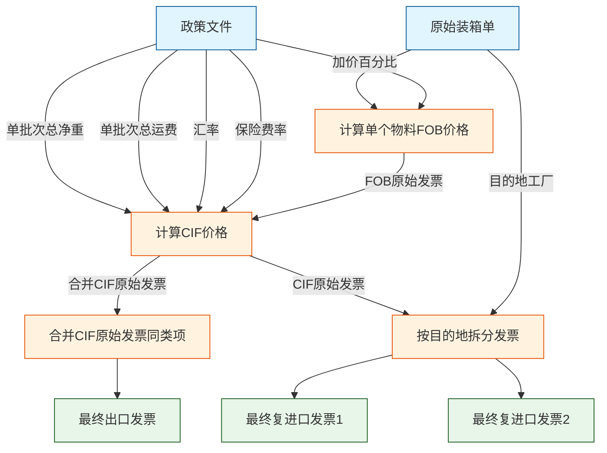
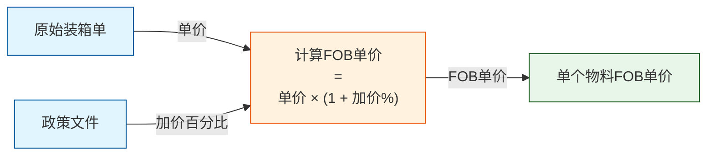
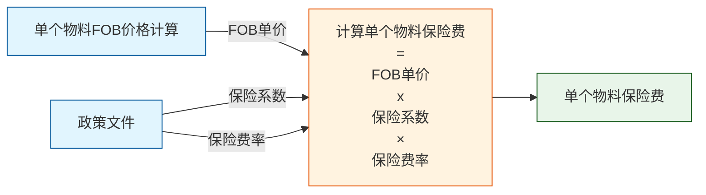
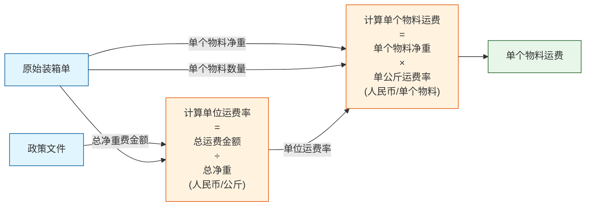
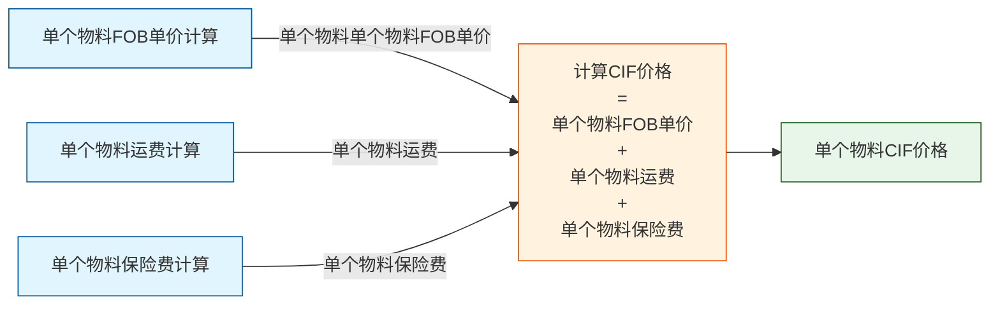

CCIF# 装运清单处理工作流程

本文档概述了处理装运清单并生成出口和复进口收据的完整工作流程。

## 流程图

### CIIBER原始装箱单到出口/在进口发票工作流程

```mermaid
graph TD
    Title[CIIBER 原始装箱单
     到出口/在进口发票流程图]
```

```mermaid
graph TD
    %% 输入文件
    OPL[原始装箱单] --> CFOB[计算单个物料FOB价格]
    
    %% FOB计算
    PF[政策文件] --> |加价百分比| CFOB
    
    %% FOB到CIF转换
    PF --> |单批次总净重|CCIF[计算CIF价格]
    PF --> |单批次总运费|CCIF
    PF --> |汇率|CCIF
    PF --> |保险费率|CCIF
    CFOB --> |FOB原始发票|CCIF
    
    %% CIF到最终发票处理
    CCIF --> |合并CIF原始发票|MERGE[合并CIF原始发票同类项]
    MERGE --> EXP[最终出口发票]

    %% 拆分原始发票
    CCIF --> |CIF原始发票|SI[按目的地拆分发票]
    OPL --> |目的地工厂|SI
    SI --> RIMP1[最终复进口发票1]
    SI --> RIMP2[最终复进口发票2]

    %% 样式
    classDef input fill:#e1f5fe,stroke:#01579b
    classDef process fill:#fff3e0,stroke:#e65100
    classDef output fill:#e8f5e9,stroke:#1b5e20
    
    class OPL,PF input
    class CFOB,CCIF,SI,CFEI,MIL2,MIL3,MIL4,MERGE process
    class EXP,EXP1,RIMP1,RIMP2 output
```

### 单个物料FOB价格计算详情

```mermaid
graph LR
    %% 输入值
    OPL[原始装箱单] --> |单价|FOBUP["计算FOB单价
    =
    单价 × (1 + 加价%)"]

    PF[政策文件] --> |"加价百分比"|FOBUP

    
    %% 计算过程
    FOBUP -- "FOB单价" --> FOBT_RESULT[单个物料FOB单价]

    
    %% 样式
    classDef input fill:#e1f5fe,stroke:#01579b
    classDef process fill:#fff3e0,stroke:#e65100
    classDef output fill:#e8f5e9,stroke:#1b5e20
    
    class OPL,PF input
    class FOBUP,FOBT process
    class FOBT_RESULT output
```

### 单个物料保险费计算详情

```mermaid
graph LR
    %% 输入值
    FOBUP[单个物料FOB价格计算] --> |FOB单价|PIA["计算单个物料保险费
    =
    FOB单价
    x
    保险系数
    ×
    保险费率"]
    
    PF[政策文件] --> |保险系数|PIA
    PF[政策文件] --> |保险费率|PIA
    
    %% 计算过程
    PIA --> PIA_RESULT[单个物料保险费]
    
    %% 样式
    classDef input fill:#e1f5fe,stroke:#01579b
    classDef process fill:#fff3e0,stroke:#e65100
    classDef output fill:#e8f5e9,stroke:#1b5e20
    
    class FOBUP,PF input
    class PIA process
    class PIA_RESULT output
```

### 单个物料运费计算详情

```mermaid
graph LR
    %% 单位运费率的输入值
    User[政策文件] --> |总运费金额|UFR["计算单位运费率
    =
    总运费金额
    ÷
    总净重
    (人民币/公斤)"]
    OPL[原始装箱单] --> |总净重|UFR
    
    %% 单个物料运费的输入值
    OPL[原始装箱单] --> |单个物料净重|PFC["计算单个物料运费
    =
    单个物料净重
    ×
    单公斤运费率
    (人民币/单个物料)"]
    OPL[原始装箱单] --> |单个物料数量|PFC
    
    %% 计算流程
    UFR --> |"单位运费率"|PFC
    PFC --> PFC_RESULT[单个物料运费]
    
    %% 样式
    classDef input fill:#e1f5fe,stroke:#01579b
    classDef process fill:#fff3e0,stroke:#e65100
    classDef output fill:#e8f5e9,stroke:#1b5e20
    
    class User,OPL input
    class UFR,PFC process
    class PFC_RESULT output
```

### 单个物料CIF价格计算详情

```mermaid
graph LR
    %% 输入组件
    FOBUP[单个物料FOB单价计算] --> |单个物料单个物料FOB单价|CIF["计算CIF价格
    =
    单个物料FOB单价
    +
    单个物料运费
    +
    单个物料保险费"]
    FC[单个物料运费计算] --> |单个物料运费|CIF
    IC[单个物料保险费计算] --> |单个物料保险费|CIF
    
    %% 最终CIF价格
    CIF --> CIF_RESULT[单个物料CIF价格]
    
    %% 样式
    classDef input fill:#e1f5fe,stroke:#01579b
    classDef process fill:#fff3e0,stroke:#e65100
    classDef output fill:#e8f5e9,stroke:#1b5e20
    
    class FOBUP,FC,IC input
    class CIF process
    class CIF_RESULT output
```
