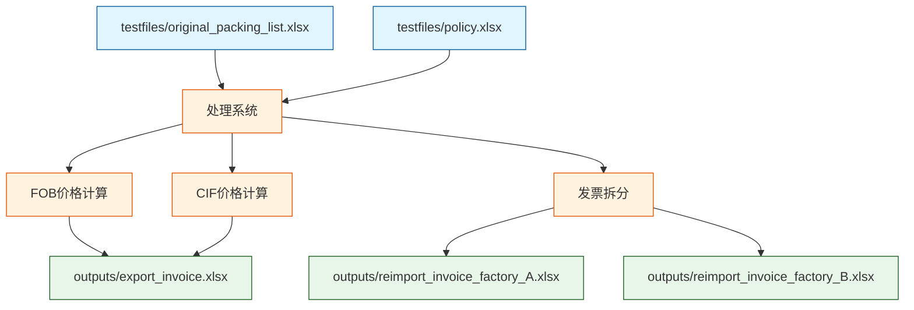

# 装运清单处理工作流程

本文档概述了处理装运清单并生成出口和复进口收据的完整工作流程。

## 流程图

### CIIBER原始装箱单到出口/在进口发票工作流程

### 单个物料FOB价格计算详情

### 单个物料保险费计算详情

### 单个物料运费计算详情

### 单个物料CIF价格计算详情

## 测试文件和输出

### 输入文件

系统使用以下Excel文件作为测试输入：

1. **原始装箱单 (testfiles/original_packing_list.xlsx)**
   - 包含物料编号、描述、单价、数量、净重
   - 每个物料的目的地工厂信息
   - 物料规格和包装信息

2. **政策文件 (testfiles/policy.xlsx)**
   - 加价百分比设置
   - 保险费率和保险系数
   - 汇率信息
   - 运费总金额
   - 其他计算参数

### 输出文件

系统处理后生成以下Excel输出文件：

1. **最终出口发票 (outputs/export_invoice.xlsx)**
   - 合并后的CIF价格发票
   - 包含所有物料的汇总信息
   - 总金额和计算明细

2. **最终复进口发票 (outputs/reimport_invoice_factory_*.xlsx)**
   - 按目的地工厂拆分的发票
   - 每个目的地工厂对应一个独立的发票文件
   - 包含该工厂相关物料的CIF价格和明细

### 数据处理流程

### 测试文件格式要求

#### 原始装箱单 (original_packing_list.xlsx)
- **物料信息表**: 包含物料编号、描述、规格等基本信息
- **价格信息表**: 包含单价、数量、净重等计算所需数据
- **目的地信息表**: 标明每个物料的目的地工厂代码

#### 政策文件 (policy.xlsx)
- **加价政策表**: 不同类型物料的加价百分比
- **费率表**: 保险费率、运费计算参数
- **汇率表**: 不同货币的汇率信息

### 输出文件格式说明

#### 出口发票 (export_invoice.xlsx)
- 包含所有物料的FOB和CIF价格
- 汇总的总金额和各项费用明细
- 按物料类型分类的统计信息

#### 复进口发票 (reimport_invoice_factory_*.xlsx)
- 每个目的地工厂的专属发票
- 仅包含该工厂相关的物料信息
- 该工厂物料的CIF价格和费用明细
