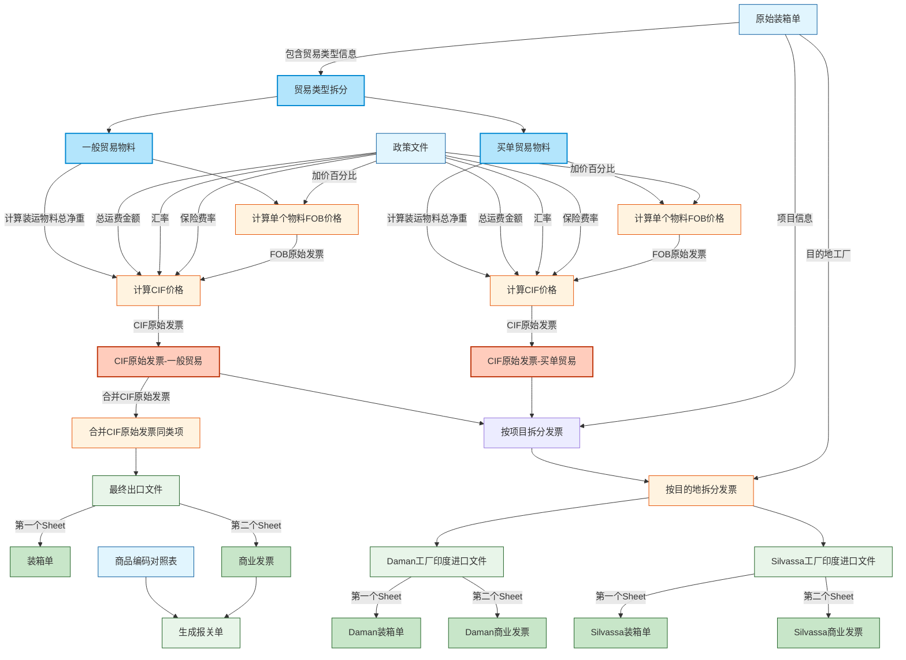

# 装运清单处理工作流程

本文档概述了处理装运清单并生成出口和印度进口收据的完整工作流程。

## 辅料材发运概述

辅料材发运是指公司在国内采购生产所需的辅料材，被发运至 PCT-Daman 工厂或者 PCT-Silvassa 工厂的过程。

发运可以通过海运或者空运的方式。分为两个阶段：出口段和进口段。

在出口段，出口报关方式分为两种：一般贸易和买单贸易。
- 一般贸易时，发货人 shipper 为创想（即创想-PCT）。
- 买单贸易时，发货人 shipper 为 Unicair（即 UC-PCT）。

**重要说明**：贸易类型由原始装箱单中的"出口报关方式"列确定，系统将自动识别并处理不同贸易类型的物料。

## 流程图

### CIIBER原始装箱单到出口/在印度进口发票工作流程



### 单个物料FOB价格计算详情


### 单个物料保险费计算详情


### 单个物料运费计算详情


### 单个物料CIF价格计算详情


## 测试文件和输出

### 输入文件

系统使用以下Excel文件作为测试输入：

1. **原始装箱单 (testfiles/original_packing_list.xlsx)**
   - 包含物料编号、描述、单价、数量、净重
   - 每个物料的目的地工厂信息
   - 物料规格和包装信息
   - **重要说明**：
     - 总净重从装箱单中每个物料的净重汇总计算得出，而不是从政策文件获取
     - 贸易类型信息（一般贸易/买单贸易）从"出口报关方式"列识别，系统会自动处理不同类型的物料

2. **政策文件 (testfiles/policy.xlsx)**
   - 加价百分比设置
   - 保险费率和保险系数
   - 汇率信息
   - 运费总金额
   - 其他计算参数
   - **注意**: 虽然政策文件可能包含总净重字段，但实际计算中使用的是从装箱单计算得出的总净重

3. **商品编码对照表 (testfiles/hs_code_mapping.xlsx)**
   - 包含物料编号与海关商品编码的对应关系
   - 用于生成报关单所需的商品编码信息

### 输出文件

系统处理后生成以下Excel输出文件：

1. **CIF原始发票 (outputs/cif_original_invoice.xlsx)**
   - 包含所有物料的CIF价格计算详情（包括一般贸易和买单贸易）
   - 包含全部计算字段，用于验证CIF价格计算是否正确
   - 是生成出口发票和印度进口发票的中间文件

2. **最终出口文件 (outputs/export_invoice.xlsx)** - **仅适用于一般贸易物料**
   - 包含两个工作表(Sheet):
     - **Sheet1 - 装箱单(Packing List)**: 包含一般贸易物料的完整装箱单信息
     - **Sheet2 - 商业发票(Commercial Invoice)**: 合并一般贸易物料的CIF原始发票中相同物料代码和相同单价的项目的商业发票
   - 合并过程会更新数量(Qty)和总价(Amount)
   - 包含简化字段集: NO., Material code, DESCRIPTION, Model NO., Unit Price, Qty, Unit, Amount, Shipper
   - **数值精度要求**:
     - 单价(Unit Price): 保留6位小数
     - 总价(Amount): 保留2位小数
   - **合并说明**: 对于发票来说，同物料编号(Material code)和同单价(Unit Price)的项目会被合并，与箱号(Box Number)无关
   - **注意**: 只有一般贸易物料会生成出口文件，发货人(Shipper)为"创想(创想-PCT)"
   - **如果没有一般贸易物料，则不会生成此文件**

3. **最终印度进口发票 (outputs/reimport_invoice_factory_*.xlsx)**
   - 从CIF原始发票先按项目拆分，再按目的地工厂(factory)拆分
   - 包含所有物料（一般贸易和买单贸易）
   - 每个项目和目的地工厂组合对应一个独立的发票文件
   - 每个文件包含两个工作表(Sheet):
     - **Sheet1 - 装箱单(Packing List)**: 包含该项目该工厂的完整装箱单信息
     - **Sheet2 - 商业发票(Commercial Invoice)**: 包含该项目该工厂的商业发票信息
   - 包含简化字段集: NO., Material code, DESCRIPTION, Model NO., Unit Price, Qty, Unit, Amount, Shipper
   - 发货人信息会根据原始装箱单中的贸易类型自动设置:
     - 一般贸易物料: 发货人为"创想(创想-PCT)"
     - 买单贸易物料: 发货人为"Unicair(UC-PCT)"

4. **报关单文件 (outputs/customs_declaration.xlsx)** - **仅适用于一般贸易物料**
   - 基于最终出口文件和商品编码对照表生成
   - 包含海关所需的商品编码信息
   - 用于办理出口报关手续

### 贸易类型识别机制

系统会自动从原始装箱单中识别贸易类型：

1. 首先尝试查找"出口报关方式"或类似列
2. 对每个物料行进行分析，将其归类为"一般贸易"或"买单贸易"：
   - 如果列值包含"买单"，则识别为"买单贸易"
   - 其他情况识别为"一般贸易"
   - 如果字段为空，默认视为"一般贸易"

3. 根据贸易类型为每行设置相应的发货人信息：
   - 一般贸易：创想(创想-PCT)
   - 买单贸易：Unicair(UC-PCT)

### 制作出口报关资料

根据辅料材发运的贸易类型，需要制作不同的出口报关资料:

1. 一般贸易：
   - 需要制作发票(commercial invoice)
   - 需要制作装箱单(packing list)
   - 需要制作报关单(不在本系统处理范围内)

2. 买单（不申报出口）：
   - 不需要做出口资料
   - 需要做进口资料

### 数据处理流程

```mermaid
graph TD
    %% 输入文件
    PL[testfiles/original_packing_list.xlsx] --> Process[处理系统]
    PF[testfiles/policy.xlsx] --> Process
    
    %% 贸易类型拆分
    Process --> TradeTypeSplit[贸易类型识别及拆分]
    TradeTypeSplit --> GeneralTrade[一般贸易物料]
    TradeTypeSplit --> PurchaseTrade[买单贸易物料]
    
    %% 处理步骤 - 两种贸易类型均计算
    GeneralTrade --> FOB_GT[FOB价格计算]
    PurchaseTrade --> FOB_PT[FOB价格计算]
    FOB_GT --> CIF_GT[CIF价格计算]
    FOB_PT --> CIF_PT[CIF价格计算]
    
    %% 生成CIF原始发票 - 包含所有物料
    CIF_GT --> CIFORG[生成CIF原始发票]
    CIF_PT --> CIFORG
    
    %% 一般贸易物料 - 生成出口文件
    GeneralTrade --> GeneralTradeCheck[检查是否有一般贸易物料]
    GeneralTradeCheck -->|Yes| MERGE[合并同料号同价格的项目]
    MERGE --> Export[outputs/export_invoice.xlsx]
    GeneralTradeCheck -->|No| NoExport[不生成出口文件]
    
    %% 出口文件的两个Sheet - 仅适用于一般贸易
    Export --> ExpSheet1[Sheet1: 装箱单(Packing List)]
    Export --> ExpSheet2[Sheet2: 商业发票(Commercial Invoice)]
    
    %% 印度进口处理 - 全部物料
    CIFORG --> PSplit[按项目拆分]
    PSplit --> DSplit[按工厂拆分]
    DSplit --> Reimport1[outputs/reimport_invoice_project_A_factory_A.xlsx]
    DSplit --> Reimport2[outputs/reimport_invoice_project_A_factory_B.xlsx]
    DSplit --> Reimport3[outputs/reimport_invoice_project_B_factory_A.xlsx]
    DSplit --> Reimport4[outputs/reimport_invoice_project_B_factory_B.xlsx]
    
    %% 样式
    classDef input fill:#e1f5fe,stroke:#01579b
    classDef process fill:#fff3e0,stroke:#e65100
    classDef output fill:#e8f5e9,stroke:#1b5e20
    classDef highlight fill:#ffccbc,stroke:#bf360c,stroke-width:2px
    classDef suboutput fill:#c8e6c9,stroke:#1b5e20
    classDef split fill:#b3e5fc,stroke:#0288d1,stroke-width:2px
    classDef negative fill:#ffcdd2,stroke:#c62828,stroke-width:1px
    
    class PL,PF input
    class Process,FOB_GT,FOB_PT,CIF_GT,CIF_PT,MERGE,PSplit,DSplit process
    class TradeTypeSplit,GeneralTrade,PurchaseTrade,GeneralTradeCheck split
    class CIFORG highlight
    class Export,Reimport1,Reimport2,Reimport3,Reimport4 output
    class ExpSheet1,ExpSheet2 suboutput
    class NoExport negative
```

### 特别说明

1. 本系统在计算运费分摊时，使用从装箱单中汇总计算的总净重，而不是政策文件中可能提供的预设总净重。这确保了运费分摊基于实际装运物料的准确净重。

2. 对于一般贸易和买单贸易的处理差异：
   - 一般贸易：系统会生成包含装箱单和商业发票的完整出口文件，以及相应的印度进口发票
   - 买单贸易：系统不会生成出口文件，仅生成印度进口发票部分

3. 发货人(Shipper)信息会根据贸易类型自动设置，无需用户手动指定：
   - 一般贸易：创想（创想-PCT）
   - 买单贸易：Unicair（UC-PCT）

4. 如果原始装箱单中没有一般贸易的物料，系统将不会生成出口发票文件，只会生成印度进口发票。

5. 合并CIF原始发票同类项的规则：
   - 合并依据是物料编号(Material code)和单价(Unit Price)相同
   - 合并过程不考虑箱号(Box Number)，即使物料分布在不同箱子中，只要物料编号和单价相同，也会被合并
   - 合并仅在生成商业发票(Commercial Invoice)时进行，装箱单(Packing List)保持原始记录不变

6. 印度进口发票的拆分规则：
   - 第一步：按项目拆分CIF原始发票
     - 拆分依据来自原始装箱单中的项目信息
   - 第二步：对每个项目的发票按目的地工厂进行拆分
     - 拆分依据来自原始装箱单中的工厂信息
   - 生成的文件命名格式为：reimport_invoice_project_[项目代号]_factory_[工厂代号].xlsx
   - 每个项目和工厂组合生成独立的发票文件
   - **注意**: 项目信息和目的地工厂信息都直接从原始装箱单获取，确保数据的准确性和一致性
